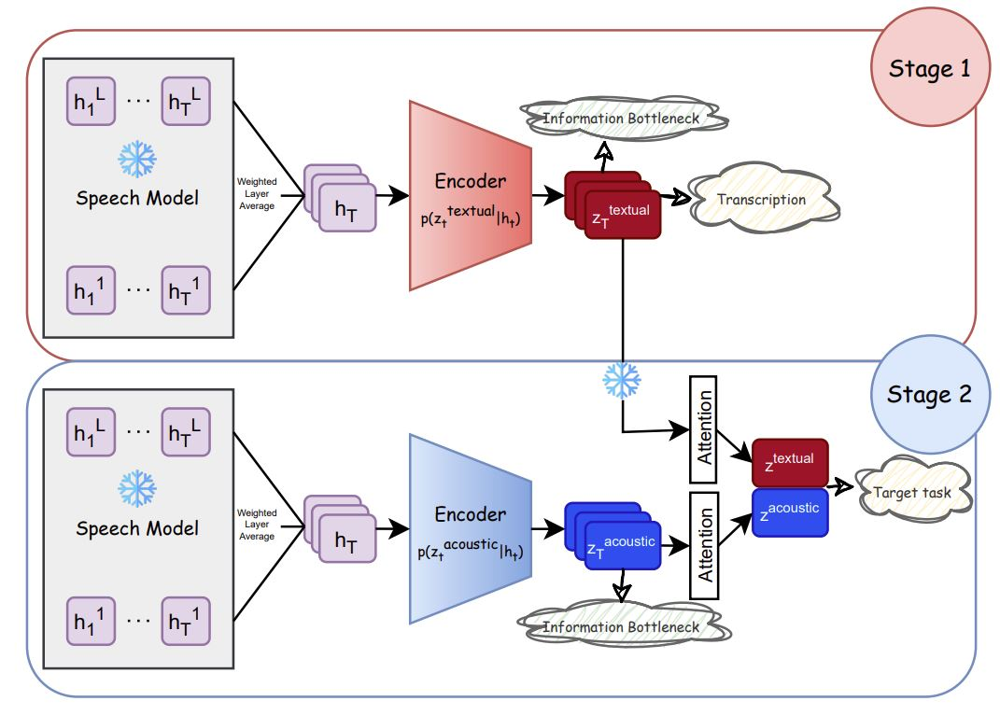

# Disentangling Textual and Acoustic Features of Neural Speech Representations

This repository contains the code adn the model checkpoints for the paper _"Disentangling Textual and Acoustic Features of Neural Speech Representations"_. It proposes a disentanglement framework based on the Information Bottleneck principle, which effectively separates entangled representations of neural speech models into distinct textual and acoustic components. The framework retains only the features relevant to target tasks, improving interpretability while maintaining the model's original performance. The framework is also proving useful in providing a route to perform _disentangled feature attribution_, revealing the most significant speech frame representations from both textual and acoustic perspectives.

📃[[Paper]](https://arxiv.org/abs/???)


## Approach
<p align="center">
  
</p>

- In _stage 1_, we train a decoder with two objectives: to map the internal representation of an existing speech model to text, but also minimize the presence of irrelevant information in these representations. The goal is to ensure that the latent representation $z^{textual}$ retains only the speech features necessary for accurate transcription while filtering out any extraneous characteristics.

- In _stage 2_, we train a second decoder on the same speech representations. This decoder also has access to the latent 'textual' representation learned in stage 1, and is again trained with 2 objectives: to predict our target task, and to minimize the amount of information encoded in the vector. This objective ensures that the latent representation $z^{acoustic}$ learned in stage 2 avoids encoding textual information – since the decoder already has access to it and the information minimization term discourages redundancy. Instead, it is expected to capture additional acoustic characteristics that are beneficial for the target task.

- The attention layer in stage 2 of our framework can be used to identify those frames in the original audio input whose latent representations contribute most to our target tasks. Crucially, the disentanglement mechanism allows us to clearly separate the contributions of acoustic features from those of textual features, providing insight into their individual roles. 

## Reproducibility
### Training
To start the training process, use the `vib/training.py` script with the following command:: 
```
python vib/training.py --STAGE ["1" or "2"] --LEARNING_RATE [e.g., "0.0001"] --BETA_S1 ["incremental" or a constant coefficient] --BETA_S2 ["incremental" or a constant coefficient if you set stage to "2"] --DATA_S1 ["data_for_stage1"] --DATA_S2 ["data_for_stage2" if you set stage to "2"] --LATENT_DIM [the encoder bottleneck dimention e.g., "128"] --MODEL_NAME [an exising speech model] --LAYER_S1 ["all" for layer averaging, or specify] --LAYER_S2 ["all" for layer averaging, or specify] --SEED [e.g., "12"]
```
The disentangled models will be saved to `directory/models/vib`.

The textual latent representations produced in stage 1 are independent of the target task. So, you can load the textual encoder from `directory/models/vib/1/CommonVoice_LibriSpeech/` and use them to directly start your training from stage 2 on new downstream tasks, using the same speech model:
```
python vib/training.py --STAGE "2" --LEARNING_RATE "0.0001" --BETA_S1 "incremental" --BETA_S2 "incremental" --DATA_S1 "CommonVoice_LibriSpeech" --DATA_S2 "data_for_stage2" --LATENT_DIM "128" --MODEL_NAME [the same speech model as stage 1] --LAYER_S1 "all" --LAYER_S2 "all" --SEED [e.g., "12"]
```

### Sanity-check probing
In the `probing` folder, you will find scripts for evaluating the latent and original representations to verify if they are truly disentangled.

### Localizing salient frames
The `analysis` folder contains code to extract textual and acoustic attention weights trained in the framework. These can be compared with gradient-based feature attribution scores in highlighting the most salient frame representaions.


## Citing
```bibtex

```